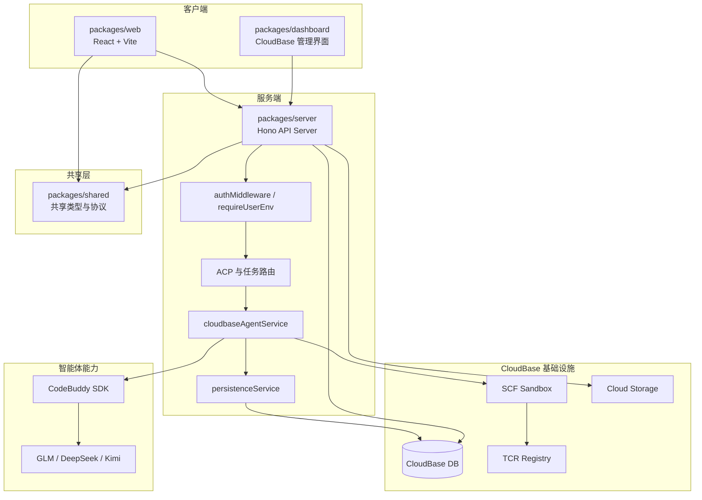
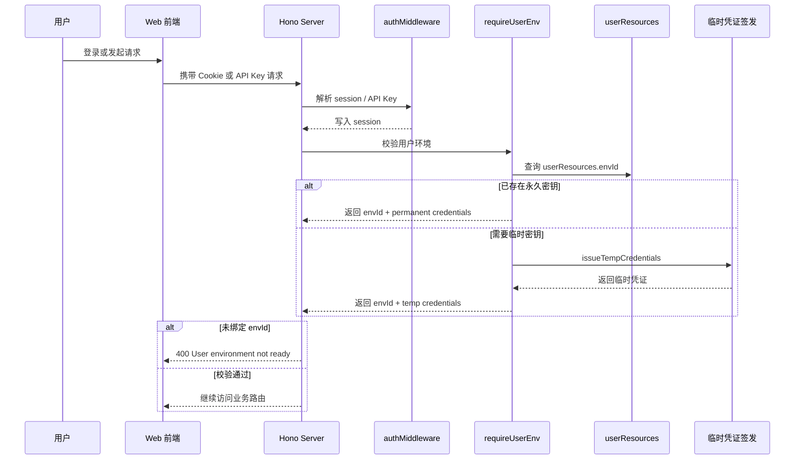
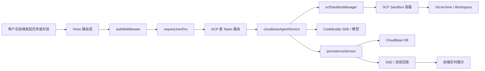
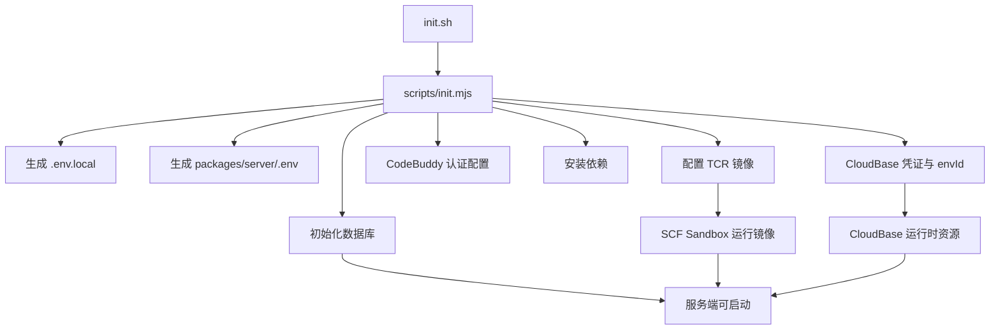

# 系统架构

本文档说明当前项目的整体架构、关键请求链路、用户环境绑定机制，以及任务执行与 Sandbox 的关系。

> 图示组织方式参考了 Cloudflare VibeSDK 的 architecture 文档：
> https://github.com/cloudflare/vibesdk/blob/main/docs/architecture-diagrams.md
>
> 但本文内容已经按当前项目的 CloudBase 平台、Hono 服务、SCF Sandbox 和初始化流程做了本地化。

## 系统概览

当前项目是一个基于 pnpm workspace 的 monorepo，核心由以下几部分组成：

- `packages/web`：面向最终用户的前端应用，负责对话、任务、日志、仓库等交互
- `packages/server`：Hono 后端，负责认证、API 路由、Agent 编排、消息持久化、Sandbox 管理
- `packages/dashboard`：CloudBase 管理向界面，偏向后台与资源管理能力
- `packages/shared`：前后端共享类型，承载 ACP、任务消息和配置等协议定义
- CloudBase 基础设施：数据库、云函数、存储、TCR 镜像服务
- CodeBuddy / AI 模型：负责智能体推理与代码生成能力

## 整体系统架构图

## Monorepo 包职责

| 包 | 作用 | 说明 |
| --- | --- | --- |
| `packages/web` | 用户前端 | 提供聊天、任务、仓库、日志等主交互界面 |
| `packages/server` | 核心后端 | 统一承载 API、认证、Agent、Sandbox、数据库访问 |
| `packages/dashboard` | 管理界面 | 提供数据库、存储等 CloudBase 管理能力 |
| `packages/shared` | 共享协议层 | 统一前后端共享的类型、消息结构和 ACP 协议 |

## 请求入口与运行时结构

服务端统一入口在 `packages/server/src/index.ts`，主要职责是：
- 注册全局 `authMiddleware`
- 挂载 `/api/auth`、`/api/agent`、`/api/tasks`、`/api/database` 等路由
- 在生产模式下同时托管 Web 静态资源
- 启动后初始化 cron scheduler 等后台能力

这意味着当前架构并不是“前后端完全分散部署”，而是支持：
- 本地开发时前后端分别启动
- 生产模式下由 server 统一提供 API 和静态文件

## 认证与用户环境绑定

当前项目不仅要求用户已登录，还要求用户已经绑定可用的 CloudBase 环境。

### 认证与环境绑定流程图

### 为什么要有 `requireUserEnv`

`requireUserEnv()` 是当前项目里一个非常关键的边界：
- 仅登录成功还不够
- 必须能为当前用户解析出 `envId`
- 下游路由拿到的不是“裸 session”，而是可直接调用 CloudBase 的 `userEnv`

这让后续路由可以直接使用：
- 用户环境 ID
- 用户 ID
- 永久或临时的 CloudBase 凭证

这种设计让任务执行、ACP、数据库与文件操作都能够建立在“用户环境已就绪”的前提上。

## 任务执行与 Sandbox 链路

当前项目有两条重要执行链路：
- `/api/agent`：偏向 ACP、流式消息和会话能力
- `/api/tasks`：偏向任务、仓库与工作区操作

它们都会依赖：
- 用户环境校验
- SCF Sandbox
- 消息持久化
- Git 归档能力

### 任务与智能体执行流程图

### 这条链路中的关键职责

#### 1. 路由层
- `acp.ts` 负责会话、消息记录、SSE 和 JSON-RPC 风格接口
- `tasks.ts` 负责任务、工作区、命令执行、文件操作与归档等能力

#### 2. Agent 层
`cloudbaseAgentService` 负责：
- 发起模型调用
- 管理智能体运行状态
- 建立与 Sandbox MCP 的通信
- 驱动流式输出

#### 3. Sandbox 层
`scfSandboxManager` 负责：
- 创建或复用 SCF Sandbox
- 生成访问 token
- 向容器请求 `/health`、`/api/session/init`、`/api/tools/bash` 等接口

#### 4. 持久化层
`persistenceService` 负责：
- 将消息存入 CloudBase DB
- 保存流式事件
- 将数据库记录恢复为前端可消费的消息格式

## ACP 与任务路由的分工

### `/api/agent`
更适合以下能力：
- 创建会话
- 拉取会话记录
- 流式 chat
- ACP 协议风格交互

### `/api/tasks`
更适合以下能力：
- 创建和管理任务
- 进入工作区执行命令
- 读写文件
- 与 GitHub / Git 归档集成
- 驱动 sandbox 内的工程级操作

这种分层让“对话协议”和“任务工作流”可以共享底层能力，但不会完全耦合在同一个路由文件里。

## 用户环境模式

初始化时可选择两种用户环境模式：

| 模式 | 说明 | 适用场景 |
| --- | --- | --- |
| `shared` | 多个用户共用支撑环境 | 默认模式，启动门槛更低 |
| `isolated` | 每个用户拥有单独环境 | 更强调隔离性与独立资源管理 |

这两种模式最终都会影响用户是否能顺利通过 `requireUserEnv()` 的检查。

如果用户环境还没准备好，依赖 CloudBase 能力的接口会直接被阻断。

## 初始化与部署准备

除了运行时架构，当前项目还依赖一套明确的初始化准备流程。

### 初始化与部署准备图

如果缺少这些准备步骤，即使 Web 和 Server 代码完整，运行时能力也可能不完整，尤其是：
- 用户环境绑定
- Sandbox 镜像准备
- CodeBuddy 认证
- CloudBase 数据库访问

## 与现有深度文档的关系

本文档是总览，详细专题请继续阅读：

- [Setup 指南](./setup.md)
- [SCF Session 共享方案](./scf-session-sharing.md)
- [定时任务云函数方案](./crontask-cloudfunction-plan.md)

如果你希望继续参考更偏“架构图组织方式”的文档，也可以直接阅读：
- [Cloudflare VibeSDK Architecture Diagrams](https://github.com/cloudflare/vibesdk/blob/main/docs/architecture-diagrams.md)

## 阅读建议

如果你是第一次接触本项目，建议按以下顺序阅读：

1. 先看根目录 `README.md`
2. 再看 [Setup 指南](./setup.md)
3. 然后阅读本文了解整体架构
4. 最后按需查看 `scf-session-sharing.md` 等专题文档
