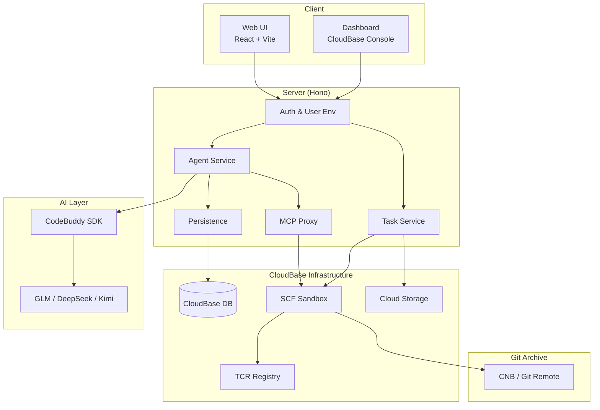
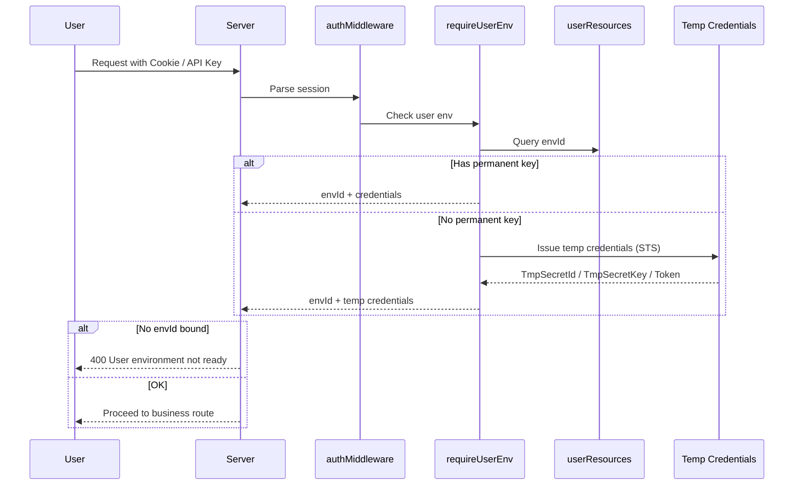
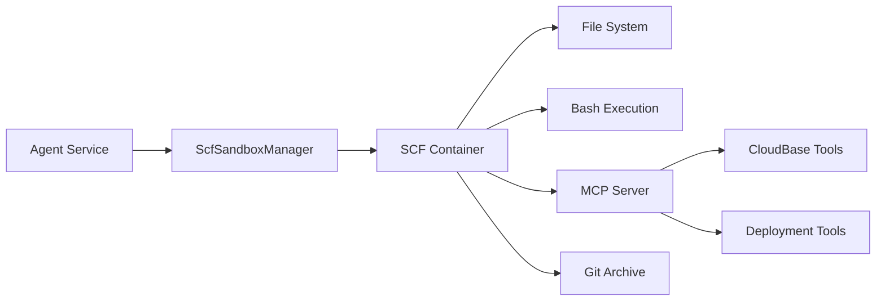
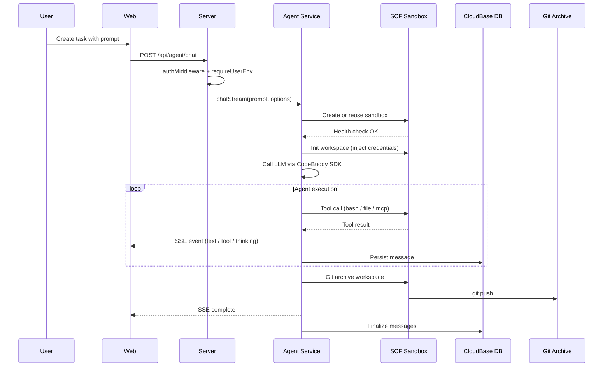

# Architecture

## Overview

CloudBase VibeCoding Platform 是一个基于腾讯云 CloudBase 的 AI 编程助手平台。用户通过 Web 界面向 Agent 下达编程指令，Agent 在隔离的 SCF Sandbox 容器中执行代码操作，结果通过 SSE 流式返回并持久化到 CloudBase 数据库。



## Project Structure

```
packages/
├── web/          # User-facing frontend
├── server/       # API server, agent orchestration, sandbox management
├── dashboard/    # CloudBase resource management console
└── shared/       # Shared types and protocol definitions
```

| Package | Responsibility |
| --- | --- |
| `packages/web` | Task creation, agent chat, log/terminal, PR operations, admin pages |
| `packages/server` | Auth, API routes, agent lifecycle, sandbox, persistence, admin |
| `packages/dashboard` | CloudBase database/storage/functions management UI |
| `packages/shared` | ACP protocol types, task/message schemas, config types |

---

## User Module

用户模块负责身份认证、会话管理和云开发环境分配。

### Authentication

支持多种认证方式，统一通过 JWE 加密 Cookie 维护会话：

| 方式 | 说明 | 入口 |
| --- | --- | --- |
| 本地账密 | 用户名 + bcrypt 密码 | `routes/auth.ts` POST `/register`, `/login` |
| GitHub OAuth | OAuth 2.0 登录或账号关联 | `routes/github-auth.ts` GET `/login`, `/callback` |
| CloudBase 身份 | CloudBase 身份源登录 | `routes/cloudbase-auth.ts` POST `/login` |
| API Key | Bearer `sak_xxx` 头部鉴权 | `middleware/auth.ts:49` |

### Cloud Environment Binding

认证成功后，系统还需要为用户绑定可用的 CloudBase 环境。这是当前平台的核心边界：



**Environment Provisioning Modes:**

| Mode | Description |
| --- | --- |
| `shared` | 所有用户共用一个 CloudBase 支撑环境（默认） |
| `isolated` | 每个用户自动分配独立 CloudBase 环境 |

注册时系统根据 `TCB_PROVISION_MODE` 自动完成环境分配。下游所有需要 CloudBase 能力的路由都通过 `requireUserEnv()` 中间件获取 `{ envId, userId, credentials }`。

---

## Agent Module

Agent 模块负责 AI 编程助手的会话管理、模型调用和流式交互。

### ACP Protocol

Agent 通过 ACP (Agent Communication Protocol) 与前端交互，基于 JSON-RPC 2.0：

| Method | Description |
| --- | --- |
| `initialize` | 协议握手，交换版本和能力 |
| `session/new` | 创建新会话 |
| `session/load` | 加载已有会话 |
| `session/prompt` | 发送用户消息，触发 Agent 执行 |
| `session/cancel` | 取消当前执行 |

流式响应通过 SSE (Server-Sent Events) 返回，支持以下事件类型：

- `text` — Agent 文本输出
- `thinking` — 推理过程
- `tool_use` / `tool_result` — 工具调用与结果
- `log` — 日志输出
- `ask_user` — Agent 向用户提问
- `tool_confirm` — 敏感工具调用需用户确认
- `artifact` — 结构化产物（部署 URL、小程序二维码、上传结果等）

### Memory & Persistence

Agent 消息采用双层持久化：

```
CloudBase DB (vibe_agent_messages)     ← 主存储，跨设备可恢复
  └─ 按 conversationId + userId 索引
Local .jsonl (~/.codebuddy/projects/)  ← 本地备份
  └─ 按 projectHash + sessionId 存储
```

**持久化内容包括：**
- 用户消息和 Agent 回复
- 工具调用及其结果
- 思考过程
- AskUserQuestion / ToolConfirm 的交互状态
- 流式事件（`vibe_agent_stream_events` 集合）

会话可在中断后恢复：通过 `session/load` 从数据库加载历史记录并重建上下文。

### Cron Tasks

支持定时触发 Agent 执行：

- 创建 / 更新 / 删除 / 启停定时任务
- 基于 cron 表达式调度
- 服务端 `cron-scheduler.ts` 在启动时加载并按计划触发

---

## Sandbox Module

Sandbox 模块为每个任务 / 会话提供隔离的执行环境。

### Architecture



### SCF Sandbox Lifecycle

1. **Create or Reuse** — `scfSandboxManager` 根据 conversationId 创建或复用云函数容器
2. **Health Check** — 轮询 `/health` 等待容器就绪
3. **Init Workspace** — 通过 `/api/session/init` 注入 CloudBase 凭证和环境变量
4. **Execute** — Agent 通过 HTTP 调用容器内的工具接口
5. **Archive** — 任务结束时通过 Git 归档工作区

### Sandbox Capabilities

每个 Sandbox 容器对外暴露以下能力：

| Capability | Endpoint | Description |
| --- | --- | --- |
| File System | `/e2b-compatible/files` | 文件读写（兼容 e2b 协议） |
| Bash | `/api/tools/bash` | Shell 命令执行 |
| Git Push | `/api/tools/git_push` | 将工作区变更推送到远端 |
| MCP Server | In-memory transport | CloudBase 工具和部署工具 |
| Health | `/health` | 容器健康检查 |

### MCP Tool Proxy

Sandbox 内通过 MCP (Model Context Protocol) 向 Agent 提供工具能力：

**动态工具** — 从 CloudBase mcporter 获取 schema，自动注册为 MCP tools：
- 数据库操作（NoSQL CRUD、SQL 执行）
- 存储操作（文件上传 / 删除）
- 云函数操作（创建 / 更新 / 调用）
- 域名管理、安全规则等

**静态工具：**
- `publishMiniprogram` — 小程序构建与发布
- `getDeployJobStatus` — 查询部署任务状态

### Workspace Persistence (Git Archive)

工作区变更通过 Git 持久化到远端仓库：

```
Git Remote (GIT_ARCHIVE_REPO)
├── branch: {envId}
│   ├── {conversationId-1}/
│   │   ├── src/
│   │   └── package.json
│   ├── {conversationId-2}/
│   │   └── ...
```

- **分支策略**：每个用户环境 (`envId`) 对应一个分支
- **目录策略**：每个会话 (`conversationId`) 对应分支下的一个目录
- **推送方式**：通过 Sandbox 内的 `/api/tools/git_push` 执行
- **清理方式**：通过 CNB Gateway API 删除远端目录或分支

### Connector Management

用户可配置额外的 MCP Server 连接器，在任务执行时注入 Agent：

| Type | Description |
| --- | --- |
| `local` | 本地进程启动的 MCP Server |
| `remote` | HTTP 远程 MCP Server |

支持 OAuth 认证和环境变量注入，敏感数据加密存储。

---

## Artifact & Deployment Module

所有 Agent 产出（部署 URL、小程序二维码、上传结果等）统一通过 `artifact` 事件传递。每个 artifact 同时创建一条 deployment 记录持久化到数据库。

### Artifact 结构

```typescript
interface Artifact {
  title: string
  description?: string
  contentType: 'image' | 'link' | 'json'
  data: string
  metadata?: Record<string, unknown>
}
```

### Web Deployment

当 `uploadFiles` 工具检测到静态托管 URL 时，产生 `contentType: 'link'` 的 artifact：
- Agent 将构建产物上传到 CloudBase Storage
- 自动提取并返回静态托管 URL
- 创建 `type: 'web'` 的 deployment 记录

### MiniProgram Deployment

通过 MCP 工具 `publishMiniprogram` 发布微信小程序，产生 `contentType: 'image'` 或 `contentType: 'json'` 的 artifact：
- 管理小程序 AppId 和私钥
- 触发 CI 构建
- 返回预览二维码（image artifact）和上传结果（json artifact）
- 通过 `getDeployJobStatus` 轮询发布状态
- 创建 `type: 'miniprogram'` 的 deployment 记录

### Deployment 记录

所有 artifact 都会创建 deployment 记录，包含：
- URL（link 类型）或 QR Code URL（image 类型）
- 标签、页面路径、AppId
- 原始 metadata

前端 Deployments 标签页统一渲染所有 deployment 记录，根据字段自动选择卡片样式（链接卡片 / 二维码卡片 / 通用卡片）。

---

## Admin Module

管理后台提供平台治理能力，仅限 `role=admin` 的用户访问。

### Capabilities

| Feature | Description |
| --- | --- |
| User Management | 用户列表、创建、禁用 / 启用、角色设置、密码重置 |
| Task Inspection | 全量任务查看、按用户筛选、消息详情 |
| Environment Overview | 所有用户的 CloudBase 环境列表 |
| Resource Proxy | 按 envId 代理访问 database / storage / functions / capi |
| Audit Log | 管理员操作日志记录与查询 |

### Resource Proxy

管理员可通过 `/api/admin/proxy/:envId/*` 以指定用户环境的身份访问 CloudBase 资源，覆盖：
- Database（集合与文档操作）
- Storage（文件管理）
- Functions（云函数调用）
- CAPI（通用腾讯云 API）

---

## CloudBase Resource Management

平台内置 CloudBase 资源管理能力，面向用户自己的云开发环境：

| Resource | Capabilities |
| --- | --- |
| Database | 集合 CRUD、文档分页查询 / 增删改 |
| Storage | 文件列表、上传 / 下载 / 删除、静态托管 |
| Functions | 云函数列表、调用 |
| CAPI | 通用腾讯云 API 代理 |

`packages/dashboard` 提供独立的管理 UI，也可嵌入到主应用的管理后台中。

---

## Data Flow

一次完整的任务执行流程：



---

## Technology Stack

| Layer | Technology |
| --- | --- |
| Frontend | React 19, Vite, Tailwind CSS 4, shadcn/ui, Jotai |
| Backend | Hono, Node.js, Drizzle ORM |
| Database | CloudBase DB (primary), SQLite (local fallback) |
| AI | CodeBuddy SDK (`@tencent-ai/agent-sdk`), MCP |
| Sandbox | CloudBase SCF, TCR container images |
| Auth | JWE session, bcrypt, Arctic (OAuth) |
| Persistence | CloudBase DB, local .jsonl, Git archive |

---

## Related Documents

- [Setup Guide](./setup.md) — 初始化流程、环境变量、验证与排障
- [SCF Session Sharing](./scf-session-sharing.md) — 沙箱会话共享方案
- [Cron Task Plan](./crontask-cloudfunction-plan.md) — 定时任务云函数演进规划
- [Cloudflare VibeSDK Architecture](https://github.com/cloudflare/vibesdk/blob/main/docs/architecture-diagrams.md) — 图示风格参考
