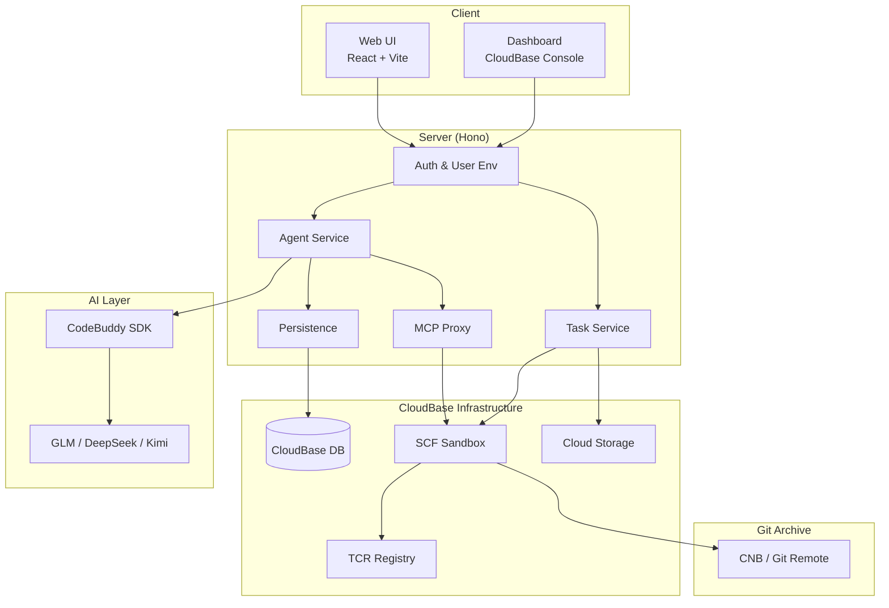
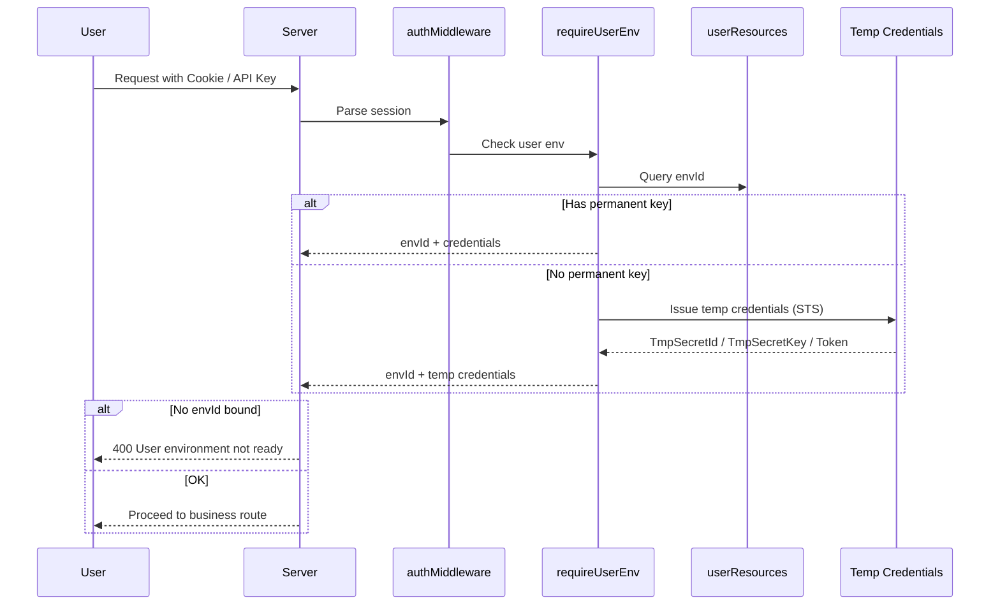
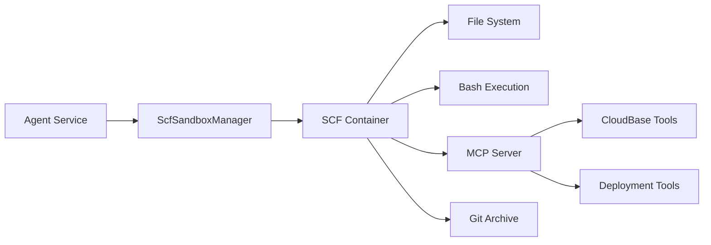
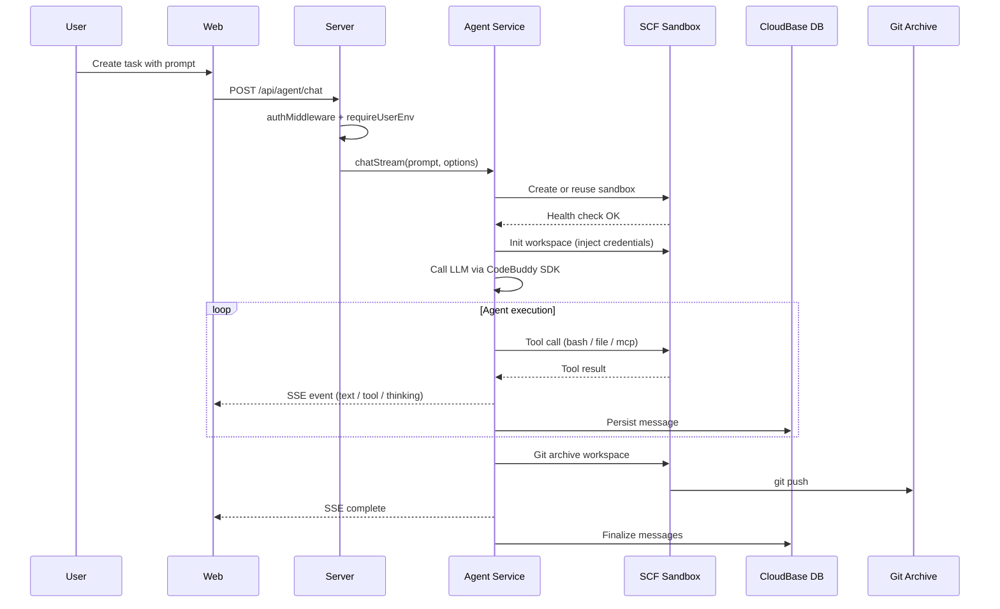
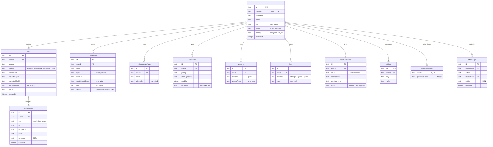

# Architecture

## Overview

CloudBase VibeCoding Platform 是一个基于腾讯云 CloudBase 的 AI 编程助手平台。用户通过 Web 界面向 Agent 下达编程指令，Agent 在隔离的 SCF Sandbox 容器中执行代码操作，结果通过 SSE 流式返回并持久化到 CloudBase 数据库。


```mermaid
graph TB
    subgraph Client["Client"]
        Web["Web UI<br/>React + Vite"]
        Dashboard["Dashboard<br/>CloudBase Console"]
    end

    subgraph Server["Server (Hono)"]
        Auth["Auth & User Env"]
        AgentSvc["Agent Service"]
        TaskSvc["Task Service"]
        Persist["Persistence"]
        MCP["MCP Proxy"]
    end

    subgraph Infra["CloudBase Infrastructure"]
        DB[("CloudBase DB")]
        SCF["SCF Sandbox"]
        Storage["Cloud Storage"]
        TCR["TCR Registry"]
    end

    subgraph AI["AI Layer"]
        SDK["CodeBuddy SDK"]
        Models["GLM / DeepSeek / Kimi"]
    end

    subgraph Git["Git Archive"]
        CNB["CNB / Git Remote"]
    end

    Web --> Auth
    Dashboard --> Auth
    Auth --> AgentSvc
    Auth --> TaskSvc
    AgentSvc --> SDK --> Models
    AgentSvc --> MCP
    MCP --> SCF
    TaskSvc --> SCF
    AgentSvc --> Persist --> DB
    SCF --> CNB
    SCF --> TCR
    TaskSvc --> Storage
```

## Project Structure

```
packages/
├── web/          # User-facing frontend
├── server/       # API server, agent orchestration, sandbox management
├── dashboard/    # CloudBase resource management console
└── shared/       # Shared types and protocol definitions
```

| Package | Responsibility |
| --- | --- |
| `packages/web` | Task creation, agent chat, log/terminal, PR operations, admin pages |
| `packages/server` | Auth, API routes, agent lifecycle, sandbox, persistence, admin |
| `packages/dashboard` | CloudBase database/storage/functions management UI |
| `packages/shared` | ACP protocol types, task/message schemas, config types |

---

## User Module

用户模块负责身份认证、会话管理和云开发环境分配。

### Authentication

支持多种认证方式，统一通过 JWE 加密 Cookie 维护会话：

| 方式 | 说明 | 入口 |
| --- | --- | --- |
| 本地账密 | 用户名 + bcrypt 密码 | `routes/auth.ts` POST `/register`, `/login` |
| GitHub OAuth | OAuth 2.0 登录或账号关联 | `routes/github-auth.ts` GET `/login`, `/callback` |
| CloudBase 身份 | CloudBase 身份源登录 | `routes/cloudbase-auth.ts` POST `/login` |
| API Key | Bearer `sak_xxx` 头部鉴权 | `middleware/auth.ts:49` |

### Cloud Environment Binding

认证成功后，系统还需要为用户绑定可用的 CloudBase 环境。这是当前平台的核心边界：


```mermaid
sequenceDiagram
    participant User
    participant Server
    participant Auth as authMiddleware
    participant Env as requireUserEnv
    participant DB as userResources
    participant STS as Temp Credentials

    User->>Server: Request with Cookie / API Key
    Server->>Auth: Parse session
    Auth->>Env: Check user env
    Env->>DB: Query envId
    alt Has permanent key
        Env-->>Server: envId + credentials
    else No permanent key
        Env->>STS: Issue temp credentials (STS)
        STS-->>Env: TmpSecretId / TmpSecretKey / Token
        Env-->>Server: envId + temp credentials
    end
    alt No envId bound
        Server-->>User: 400 User environment not ready
    else OK
        Server-->>User: Proceed to business route
    end
```

**Environment Provisioning Modes:**

| Mode | Description |
| --- | --- |
| `shared` | 所有用户共用一个 CloudBase 支撑环境（默认） |
| `isolated` | 每个用户自动分配独立 CloudBase 环境 |

注册时系统根据 `TCB_PROVISION_MODE` 自动完成环境分配。下游所有需要 CloudBase 能力的路由都通过 `requireUserEnv()` 中间件获取 `{ envId, userId, credentials }`。

---

## Agent Module

Agent 模块负责 AI 编程助手的会话管理、模型调用和流式交互。

### ACP Protocol

Agent 通过 ACP (Agent Communication Protocol) 与前端交互，基于 JSON-RPC 2.0：

| Method | Description |
| --- | --- |
| `initialize` | 协议握手，交换版本和能力 |
| `session/new` | 创建新会话 |
| `session/load` | 加载已有会话 |
| `session/prompt` | 发送用户消息，触发 Agent 执行 |
| `session/cancel` | 取消当前执行 |

流式响应通过 SSE (Server-Sent Events) 返回，支持以下事件类型：

- `text` — Agent 文本输出
- `thinking` — 推理过程
- `tool_use` / `tool_result` — 工具调用与结果
- `log` — 日志输出
- `ask_user` — Agent 向用户提问
- `tool_confirm` — 敏感工具调用需用户确认
- `artifact` — 结构化产物（部署 URL、小程序二维码、上传结果等）

### Memory & Persistence

Agent 消息采用双层持久化：

```
CloudBase DB (vibe_agent_messages)     ← 主存储，跨设备可恢复
  └─ 按 conversationId + userId 索引
Local .jsonl (~/.codebuddy/projects/)  ← 本地备份
  └─ 按 projectHash + sessionId 存储
```

**持久化内容包括：**
- 用户消息和 Agent 回复
- 工具调用及其结果
- 思考过程
- AskUserQuestion / ToolConfirm 的交互状态
- 流式事件（`vibe_agent_stream_events` 集合）

会话可在中断后恢复：通过 `session/load` 从数据库加载历史记录并重建上下文。

### Cron Tasks

支持定时触发 Agent 执行：

- 创建 / 更新 / 删除 / 启停定时任务
- 基于 cron 表达式调度
- 服务端 `cron-scheduler.ts` 在启动时加载并按计划触发

---

## Sandbox Module

Sandbox 模块为每个任务 / 会话提供隔离的执行环境。

### Architecture


```mermaid
flowchart LR
    Agent["Agent Service"] --> Manager["ScfSandboxManager"]
    Manager --> SCF["SCF Container"]
    SCF --> FS["File System"]
    SCF --> Bash["Bash Execution"]
    SCF --> MCPServer["MCP Server"]
    SCF --> Git["Git Archive"]
    MCPServer --> CloudBase["CloudBase Tools"]
    MCPServer --> Deploy["Deployment Tools"]
```

### SCF Sandbox Lifecycle

1. **Create or Reuse** — `scfSandboxManager` 根据 conversationId 创建或复用云函数容器
2. **Health Check** — 轮询 `/health` 等待容器就绪
3. **Init Workspace** — 通过 `/api/session/init` 注入 CloudBase 凭证和环境变量
4. **Execute** — Agent 通过 HTTP 调用容器内的工具接口
5. **Archive** — 任务结束时通过 Git 归档工作区

### Sandbox Capabilities

每个 Sandbox 容器对外暴露以下能力：

| Capability | Endpoint | Description |
| --- | --- | --- |
| File System | `/api/tools/read`, `/api/tools/write`, `/api/tools/edit` | 文件读写编辑 |
| Bash | `/api/tools/bash` | Shell 命令执行 |
| Git Push | `/api/tools/git_push` | 将工作区变更推送到远端 |
| MCP Server | In-memory transport | CloudBase 工具和部署工具 |
| Health | `/health` | 容器健康检查 |

### MCP Tool Proxy

Sandbox 内通过 MCP (Model Context Protocol) 向 Agent 提供工具能力：

**动态工具** — 从 CloudBase mcporter 获取 schema，自动注册为 MCP tools：
- 数据库操作（NoSQL CRUD、SQL 执行）
- 存储操作（文件上传 / 删除）
- 云函数操作（创建 / 更新 / 调用）
- 域名管理、安全规则等

**静态工具：**
- `publishMiniprogram` — 小程序构建与发布
- `getDeployJobStatus` — 查询部署任务状态

### Workspace Persistence (Git Archive)

工作区变更通过 Git 持久化到远端仓库：

```
Git Remote (GIT_ARCHIVE_REPO)
├── branch: {envId}
│   ├── {conversationId-1}/
│   │   ├── src/
│   │   └── package.json
│   ├── {conversationId-2}/
│   │   └── ...
```

- **分支策略**：每个用户环境 (`envId`) 对应一个分支
- **目录策略**：每个会话 (`conversationId`) 对应分支下的一个目录
- **推送方式**：通过 Sandbox 内的 `/api/tools/git_push` 执行
- **清理方式**：通过 CNB Gateway API 删除远端目录或分支

### Multi-Backend Support (SANDBOX_BACKEND)

Sandbox 模块支持三种后端，通过 `SANDBOX_BACKEND` 环境变量切换：

| Backend | 控制面 | 数据面 | 说明 |
| --- | --- | --- | --- |
| `scf` (默认) | `@cloudbase/manager-node` CreateFunction | HTTP via TCB 网关 (Authorization + Session-Id) | CloudBase 云函数容器 |
| `ags` | `@cloudbase/manager-node` commonService('ags') | HTTP via TCB 网关 (X-Cloudbase-Authorization + E2b-Sandbox-Id) | AGS 容器实例 |
| `lightbox` | 同 ags | 同 ags | Lightbox 微虚机（预留） |

**AGS 模式特有环境变量**：
- `AGS_SANDBOX_ID` — 预创建实例 ID（共享/开发模式，跳过动态创建）
- `AGS_TOOL_ID` — AGS Tool ID（动态创建模式）
- `AGS_SANDBOX_URL` — TCB 网关数据面 URL
- `TCB_API_KEY` — TCB 网关鉴权 Token

**AGS 模式持久化**：当容器挂载 COS 时，可通过 `/api/tools/workspace_snapshot` 执行全量文件系统快照（tar.zst → COS FUSE），与 Git Archive 互补。

### Connector Management

用户可配置额外的 MCP Server 连接器，在任务执行时注入 Agent：

| Type | Description |
| --- | --- |
| `local` | 本地进程启动的 MCP Server |
| `remote` | HTTP 远程 MCP Server |

支持 OAuth 认证和环境变量注入，敏感数据加密存储。

---

## Artifact & Deployment Module

所有 Agent 产出（部署 URL、小程序二维码、上传结果等）统一通过 `artifact` 事件传递。每个 artifact 同时创建一条 deployment 记录持久化到数据库。

### Artifact 结构

```typescript
interface Artifact {
  title: string
  description?: string
  contentType: 'image' | 'link' | 'json'
  data: string
  metadata?: Record<string, unknown>
}
```

### Web Deployment

当 `uploadFiles` 工具检测到静态托管 URL 时，产生 `contentType: 'link'` 的 artifact：
- Agent 将构建产物上传到 CloudBase Storage
- 自动提取并返回静态托管 URL
- 创建 `type: 'web'` 的 deployment 记录

### MiniProgram Deployment

通过 MCP 工具 `publishMiniprogram` 发布微信小程序，产生 `contentType: 'image'` 或 `contentType: 'json'` 的 artifact：
- 管理小程序 AppId 和私钥
- 触发 CI 构建
- 返回预览二维码（image artifact）和上传结果（json artifact）
- 通过 `getDeployJobStatus` 轮询发布状态
- 创建 `type: 'miniprogram'` 的 deployment 记录

### Deployment 记录

所有 artifact 都会创建 deployment 记录，包含：
- URL（link 类型）或 QR Code URL（image 类型）
- 标签、页面路径、AppId
- 原始 metadata

前端 Deployments 标签页统一渲染所有 deployment 记录，根据字段自动选择卡片样式（链接卡片 / 二维码卡片 / 通用卡片）。

---

## Admin Module

管理后台提供平台治理能力，仅限 `role=admin` 的用户访问。

### Capabilities

| Feature | Description |
| --- | --- |
| User Management | 用户列表、创建、禁用 / 启用、角色设置、密码重置 |
| Task Inspection | 全量任务查看、按用户筛选、消息详情 |
| Environment Overview | 所有用户的 CloudBase 环境列表 |
| Resource Proxy | 按 envId 代理访问 database / storage / functions / capi |
| Audit Log | 管理员操作日志记录与查询 |

### Resource Proxy

管理员可通过 `/api/admin/proxy/:envId/*` 以指定用户环境的身份访问 CloudBase 资源，覆盖：
- Database（集合与文档操作）
- Storage（文件管理）
- Functions（云函数调用）
- CAPI（通用腾讯云 API）

---

## CloudBase Resource Management

平台内置 CloudBase 资源管理能力，面向用户自己的云开发环境：

| Resource | Capabilities |
| --- | --- |
| Database | 集合 CRUD、文档分页查询 / 增删改 |
| Storage | 文件列表、上传 / 下载 / 删除、静态托管 |
| Functions | 云函数列表、调用 |
| CAPI | 通用腾讯云 API 代理 |

`packages/dashboard` 提供独立的管理 UI，也可嵌入到主应用的管理后台中。

---

## Data Flow

一次完整的任务执行流程：


```mermaid
sequenceDiagram
    participant User
    participant Web
    participant Server
    participant Agent as Agent Service
    participant Sandbox as SCF Sandbox
    participant DB as CloudBase DB
    participant Git as Git Archive

    User->>Web: Create task with prompt
    Web->>Server: POST /api/agent/chat
    Server->>Server: authMiddleware + requireUserEnv
    Server->>Agent: chatStream(prompt, options)
    Agent->>Sandbox: Create or reuse sandbox
    Sandbox-->>Agent: Health check OK
    Agent->>Sandbox: Init workspace (inject credentials)
    Agent->>Agent: Call LLM via CodeBuddy SDK

    loop Agent execution
        Agent->>Sandbox: Tool call (bash / file / mcp)
        Sandbox-->>Agent: Tool result
        Agent-->>Web: SSE event (text / tool / thinking)
        Agent->>DB: Persist message
    end

    Agent->>Sandbox: Git archive workspace
    Sandbox->>Git: git push
    Agent-->>Web: SSE complete
    Agent->>DB: Finalize messages
```

---

## Technology Stack

| Layer | Technology |
| --- | --- |
| Frontend | React 19, Vite, Tailwind CSS 4, shadcn/ui, Jotai |
| Backend | Hono, Node.js, Drizzle ORM |
| Database | CloudBase DB (primary), SQLite (local fallback) |
| AI | CodeBuddy SDK (`@tencent-ai/agent-sdk`), MCP |
| Sandbox | CloudBase SCF, TCR container images |
| Auth | JWE session, bcrypt, Arctic (OAuth) |
| Persistence | CloudBase DB, local .jsonl, Git archive |

---

## API Routes

所有 API 路由挂载在 `packages/server/src/index.ts`，全局应用 `authMiddleware`。

| Route | Module | Auth | Description |
| --- | --- | --- | --- |
| `GET /health` | inline | None | 健康检查 |
| `/api/auth/*` | `routes/auth.ts` | None / Cookie | 注册、登录、登出、用户信息、速率限制、API Key |
| `/api/auth/github/*` | `routes/github-auth.ts` | Cookie | GitHub OAuth 登录、回调、关联、断开 |
| `/api/auth/cloudbase/*` | `routes/cloudbase-auth.ts` | None | CloudBase 身份登录 |
| `/api/agent/*` | `routes/acp.ts` | Cookie + UserEnv | ACP 协议、会话 CRUD、SSE chat、消息记录 |
| `/api/tasks/*` | `routes/tasks.ts` | Cookie + UserEnv | 任务 CRUD、文件操作、PR 管理、Sandbox 命令 |
| `/api/github/*` | `routes/github.ts` | Cookie | GitHub 用户、仓库、组织 |
| `/api/repos/*` | `routes/repos.ts` | Cookie | 仓库 commits / issues / PRs 查询 |
| `/api/connectors/*` | `routes/connectors.ts` | Cookie | MCP 连接器 CRUD |
| `/api/miniprogram/*` | `routes/miniprogram.ts` | Cookie | 小程序应用管理 |
| `/api/crontask/*` | `routes/crontask.ts` | Cookie | 定时任务 CRUD |
| `/api/api-keys/*` | `routes/api-keys.ts` | Cookie | 用户 API Key 管理 |
| `/api/database/*` | `routes/database.ts` | Cookie + UserEnv | CloudBase 集合与文档操作 |
| `/api/storage/*` | `routes/storage.ts` | Cookie + UserEnv | CloudBase 文件管理 |
| `/api/functions/*` | `routes/functions.ts` | Cookie + UserEnv | CloudBase 云函数列表与调用 |
| `/api/sql/*` | `routes/sql.ts` | Cookie + UserEnv | SQL 查询（预留） |
| `/api/capi` | `routes/capi.ts` | Cookie + UserEnv | 通用腾讯云 API 代理 |
| `/api/admin/*` | `routes/admin.ts` | Cookie + Admin | 用户管理、任务巡检、环境代理、审计日志 |
| `/api/github-stars` | `routes/misc.ts` | None | GitHub Star 数（缓存） |
| `/api/sandboxes` | `routes/misc.ts` | Cookie + UserEnv | 活跃 Sandbox 列表 |

**Auth 列说明：**
- **None** — 无需认证
- **Cookie** — 需要登录（`requireAuth`）
- **Cookie + UserEnv** — 需要登录且用户环境已绑定（`requireUserEnv`）
- **Cookie + Admin** — 需要登录且 `role=admin`（`requireAdmin`）

---

## Database Schema

数据模型定义在 `packages/server/src/db/schema.ts`，使用 Drizzle ORM。CloudBase 模式下使用 CloudBase 文档数据库（集合名带 `vibe_agent_` 前缀），Drizzle 模式下使用 SQLite。


```mermaid
erDiagram
    users ||--o{ tasks : creates
    users ||--o{ connectors : owns
    users ||--o{ miniprogramApps : owns
    users ||--o{ cronTasks : owns
    users ||--o{ accounts : has
    users ||--o{ keys : stores
    users ||--o| userResources : binds
    users ||--o{ settings : configures
    users ||--o| localCredentials : authenticates
    tasks ||--o{ deployments : produces
    users ||--o{ adminLogs : "audited by"

    users {
        text id PK
        text provider "github | local"
        text username
        text email
        text role "user | admin"
        text status "active | disabled"
        text apiKey "encrypted sak_xxx"
        integer createdAt
    }

    localCredentials {
        text userId PK,FK
        text passwordHash "bcrypt"
    }

    tasks {
        text id PK
        text userId FK
        text prompt
        text status "pending | processing | completed | error"
        text sandboxId
        text selectedAgent
        text selectedModel
        text mcpServerIds "JSON array"
        text prUrl
        integer createdAt
    }

    deployments {
        text id PK
        text taskId FK
        text type "web | miniprogram"
        text url
        text qrCodeUrl
        text label
        text metadata "JSON"
        integer createdAt
    }

    connectors {
        text id PK
        text userId FK
        text name
        text type "local | remote"
        text baseUrl
        text oauthClientSecret "encrypted"
        text env "encrypted"
        text status "connected | disconnected"
    }

    miniprogramApps {
        text id PK
        text userId FK
        text appId
        text privateKey "encrypted"
    }

    cronTasks {
        text id PK
        text userId FK
        text prompt
        text cronExpression
        integer enabled
        text lockedBy "distributed lock"
    }

    userResources {
        text id PK
        text userId FK
        text envId "CloudBase env"
        text camSecretId
        text camSecretKey
        text status "pending | ready | failed"
    }

    accounts {
        text id PK
        text userId FK
        text provider "github"
        text accessToken "encrypted"
    }

    keys {
        text id PK
        text userId FK
        text provider "anthropic | openai | gemini..."
        text value "encrypted"
    }

    settings {
        text id PK
        text userId FK
        text key
        text value
    }

    adminLogs {
        text id PK
        text adminUserId FK
        text action
        text targetUserId FK
        text details "JSON"
        integer createdAt
    }
```

### CloudBase 专有集合

除上述表结构外，Agent 消息持久化使用 CloudBase 文档数据库的两个集合：

| Collection | Description |
| --- | --- |
| `vibe_agent_messages` | Agent 会话消息记录（按 conversationId + userId 索引） |
| `vibe_agent_stream_events` | SSE 流式事件（按 conversationId + turnId + seq 索引，用于回放） |

---

## Security Model

### Credential Encryption

所有敏感数据在入库前使用 AES-256-CBC 加密（`lib/crypto.ts`）：

| Data | Storage |
| --- | --- |
| 用户 API Key (`sak_xxx`) | `users.apiKey` — 加密存储 |
| GitHub Access Token | `accounts.accessToken` — 加密存储 |
| MCP Connector OAuth Secret | `connectors.oauthClientSecret` — 加密存储 |
| MCP Connector Env Vars | `connectors.env` — 加密存储 |
| 小程序私钥 | `miniprogramApps.privateKey` — 加密存储 |
| 用户 AI API Keys | `keys.value` — 加密存储 |
| 本地用户密码 | `localCredentials.passwordHash` — bcrypt 哈希 |

加密密钥通过 `ENCRYPTION_KEY` 环境变量配置（32 字节 hex），init 脚本自动生成。

### Session Security

- 会话通过 JWE (JSON Web Encryption) 加密存储在 HttpOnly Cookie 中
- 加密密钥为 `JWE_SECRET`（base64 编码），init 脚本自动生成
- Cookie 名称：`nex_session`

### CloudBase Credential Isolation

- 系统级密钥（`TCB_SECRET_ID` / `TCB_SECRET_KEY`）仅用于支撑环境操作
- 用户级操作通过 STS 签发临时凭证，scope 限定在用户自己的 `envId` 内
- 临时凭证有效期 2 小时，提前 5 分钟自动刷新，内存缓存
- `isolated` 模式下每个用户拥有独立 CAM 子用户和密钥

### Log Security

所有日志输出必须使用静态字符串，禁止包含动态值（详见 `AGENTS.md`）。`redactSensitiveInfo()` 函数作为二级防护，自动脱敏已知敏感模式（API Key、Token、密钥等）。

### Admin Access Control

- 管理后台路由通过 `requireAdmin` 中间件保护
- 管理员操作记录到 `adminLogs` 表，包含操作类型、目标用户、IP 和 User-Agent
- 管理员代理访问用户环境时使用系统级凭证，不继承用户凭证

---

## Related Documents

- [Setup Guide](./setup.md) — 初始化流程、环境变量、验证与排障
- [SCF Session Sharing](./scf-session-sharing.md) — 沙箱会话共享方案
- [Cron Task Plan](./crontask-cloudfunction-plan.md) — 定时任务云函数演进规划
