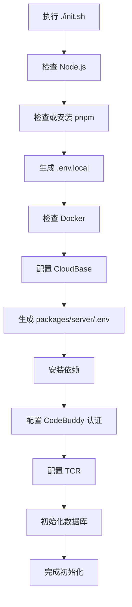

# Setup 指南

本文档补充根目录 `README.md` 中的 setup 说明，重点覆盖：
- 前置条件
- `./init.sh` 与 `scripts/init.mjs` 的实际执行流程
- 关键环境变量职责
- 初始化完成后的验证方式
- 常见问题排障

> setup / quickstart 的组织方式参考了 Cloudflare VibeSDK 的 README：
> https://github.com/cloudflare/vibesdk/blob/main/README.md
>
> 但本文内容已经按当前项目的 CloudBase 架构、初始化脚本和配置方式做了本地化。

## 前置条件

### 必需项
- Node.js >= 18
- Docker 已安装并已启动
- 腾讯云账号，且已准备 CloudBase 环境
- 可用的腾讯云 API 密钥（`SecretId` / `SecretKey`）
- 至少一种 CodeBuddy 认证方式：
  - API Key
  - OAuth（企业旗舰版）

### 可选项
- GitHub OAuth 配置
- Git Archive（CNB）归档配置
- 自定义 TCR 命名空间、镜像名和标签

## 推荐初始化方式

### 方式 1：使用入口脚本

```bash
git clone <repository-url>
cd coding-agent-template
./init.sh
```

`init.sh` 会先做基础检查，然后委托 `scripts/init.mjs` 完成交互式初始化。

### 方式 2：直接执行主脚本

如果你已经确认当前环境满足要求，也可以直接运行：

```bash
node scripts/init.mjs
```

## 初始化流程总览

当前项目的初始化逻辑以 `scripts/init.mjs` 为准。整体流程如下：



## 各步骤说明

| 步骤 | 脚本位置 | 作用 |
| --- | --- | --- |
| 1 | `init.sh` | 检查 Node.js 与 pnpm 是否可用 |
| 2 | `scripts/init.mjs#setupEnv` | 创建根目录 `.env.local`，写入基础密钥和默认值 |
| 3 | `scripts/init.mjs#checkDocker` | 确认 Docker 可用，因为后续 TCR 配置依赖本地镜像能力 |
| 4 | `scripts/init.mjs#setupCloudbaseConfig` | 引导输入腾讯云密钥、选择 `TCB_ENV_ID`、设置 `TCB_PROVISION_MODE` |
| 5 | `scripts/init.mjs#setupServerEnv` | 生成 `packages/server/.env`，写入服务端运行需要的配置 |
| 6 | `scripts/init.mjs#installDependencies` | 执行 `pnpm install`，并尝试重建 `better-sqlite3` |
| 7 | `scripts/init.mjs#setupCodebuddy` | 配置 CodeBuddy API Key 或 OAuth |
| 8 | `scripts/init.mjs#setupTcr` | 配置 TCR 镜像仓库并推送默认镜像 |
| 9 | `scripts/init.mjs` 主流程 | 根据数据库模式完成数据库初始化 |

## 配置文件职责

### `.env.local`
根目录 `.env.local` 主要保存：
- `JWE_SECRET`
- `ENCRYPTION_KEY`
- `NEXT_PUBLIC_AUTH_PROVIDERS`
- 一些默认限制项（如消息数、sandbox 持续时间）

它更偏向项目级和前后端共享的基础配置。

### `packages/server/.env`
`packages/server/.env` 主要保存服务端运行所需配置，例如：
- CloudBase 相关配置（`TCB_ENV_ID`、`TCB_SECRET_ID`、`TCB_SECRET_KEY`）
- CodeBuddy 认证配置
- 数据库提供方配置
- SCF Sandbox / TCR 配置
- 可选的 GitHub OAuth、代理配置

初始化脚本会优先把 CloudBase 和服务端相关配置写入这里。

## 关键环境变量

### CloudBase

| 变量 | 必需 | 说明 |
| --- | --- | --- |
| `TCB_ENV_ID` | 是 | 当前项目使用的 CloudBase 支撑环境 ID |
| `TCB_SECRET_ID` | 是 | 腾讯云 API 密钥 ID |
| `TCB_SECRET_KEY` | 是 | 腾讯云 API 密钥 Key |
| `TCB_REGION` | 否 | 默认是 `ap-shanghai` |
| `TCB_PROVISION_MODE` | 否 | 用户环境模式，支持 `shared` 和 `isolated` |

### CodeBuddy 认证

| 变量 | 必需 | 说明 |
| --- | --- | --- |
| `CODEBUDDY_API_KEY` | 二选一 | 推荐方式，个人用户可直接使用 |
| `CODEBUDDY_INTERNET_ENVIRONMENT` | 否 | 区分国内版 / 海外版 / iOA |
| `CODEBUDDY_CLIENT_ID` | 二选一 | OAuth 模式下使用 |
| `CODEBUDDY_CLIENT_SECRET` | 二选一 | OAuth 模式下使用 |
| `CODEBUDDY_OAUTH_ENDPOINT` | 否 | OAuth Token 端点，默认使用国内地址 |

### Sandbox / TCR

| 变量 | 必需 | 说明 |
| --- | --- | --- |
| `SCF_SANDBOX_IMAGE_TYPE` | 否 | 镜像类型，默认 `personal` |
| `SCF_SANDBOX_IMAGE_URI` | 是 | SCF Sandbox 所使用的镜像 URI |
| `SCF_SANDBOX_IMAGE_PORT` | 否 | 容器暴露端口，默认 `9000` |
| `TCR_IMAGE` | 建议 | `setup-tcr` 成功后会写入，用于 sandbox 镜像配置 |

## 用户环境模式

初始化时需要选择 `TCB_PROVISION_MODE`。

### `shared`
- 默认推荐模式
- 所有用户复用同一个 CloudBase 环境
- 配置简单，适合作为默认启动方式

### `isolated`
- 每个用户单独分配环境
- 对账号余额、权限和环境创建能力有更高要求
- 适合需要更强隔离性的场景

服务端会在请求进入需要环境能力的路由时，通过 `requireUserEnv()` 检查用户是否已经具备 `envId`。如果没有，会返回 `User environment not ready`。

## 初始化完成后的验证清单

完成初始化后，建议至少检查以下内容。

### 文件与配置
- [ ] 根目录存在 `.env.local`
- [ ] `packages/server/.env` 已生成
- [ ] `packages/server/.env` 中已包含 `TCB_ENV_ID`
- [ ] 已配置 CodeBuddy API Key 或 OAuth 信息
- [ ] 已生成或写入 sandbox 镜像相关配置

### 依赖与资源
- [ ] `pnpm install` 成功完成
- [ ] `better-sqlite3` 没有残留构建错误
- [ ] TCR 配置已完成
- [ ] 数据库初始化没有报错

### 启动后检查
根据你的使用方式，可执行以下命令：

```bash
pnpm build
pnpm start
```

或在本地调试时分别启动前端和服务端。

启动后建议检查：
- [ ] `GET /health` 返回 `{"status":"ok"}`
- [ ] Web 页面可正常打开
- [ ] 可以正常登录
- [ ] 可以创建会话或任务
- [ ] 涉及用户环境的操作不再出现 `User environment not ready`

## 常见问题排障

### Docker 未启动

**现象**
- 初始化过程中在 Docker 检查阶段失败

**处理方式**
- 确认本机 Docker 已安装
- 确认 Docker daemon 已启动
- 重新执行 `./init.sh`

### pnpm 检查失败或 corepack 签名错误

**现象**
- `pnpm --version` 执行失败
- 提示 `signature`、`keyid` 或类似校验错误

**处理方式**
- 重新启用 corepack
- 或手动全局安装 pnpm
- 再次执行初始化脚本

### CloudBase CLI 登录或环境列表获取失败

**现象**
- 无法列出可用环境
- `cloudbase login` 失败

**处理方式**
- 确认腾讯云密钥有效
- 确认账号对目标环境具有访问权限
- 如有代理需求，先配置代理再重新执行
- 如 CLI 无法返回环境列表，可手动输入已有 `TCB_ENV_ID`

### `User environment not ready`

**现象**
- 登录后执行任务或 ACP 相关操作时返回 `400`

**处理方式**
- 检查当前用户是否已经完成 CloudBase 环境绑定
- 检查 `TCB_PROVISION_MODE` 是否符合预期
- 如果使用 `isolated`，确认用户环境已成功创建
- 参考 `packages/server/src/middleware/auth.ts` 中的 `requireUserEnv()` 逻辑排查

### TCR 配置失败

**现象**
- 初始化到 TCR 阶段失败
- sandbox 镜像未准备好

**处理方式**
- 确认 Docker 可用
- 确认 CloudBase / TCR 权限正常
- 单独执行以下命令重新配置：

```bash
pnpm setup:tcr
```

### better-sqlite3 构建失败

**现象**
- 依赖安装成功，但原生模块编译失败

**处理方式**
- 先确认当前 Node.js 版本符合要求
- 再尝试手动执行：

```bash
pnpm rebuild better-sqlite3
```

## 手动初始化的推荐顺序

如果不使用交互式脚本，建议按照以下顺序手动处理：

1. 准备 `.env.local`
2. 准备 `packages/server/.env`
3. 安装依赖
4. 配置 CodeBuddy 认证
5. 配置 TCR 镜像
6. 初始化数据库
7. 运行构建或启动命令验证环境

## 延伸阅读

- [根目录 README](../README.md)
- [系统架构文档](./architecture.md)
- [SCF Session 共享方案](./scf-session-sharing.md)
- [Cloudflare VibeSDK README](https://github.com/cloudflare/vibesdk/blob/main/README.md)
